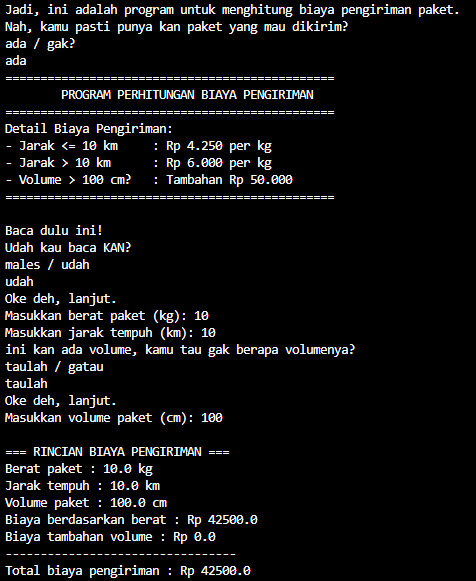
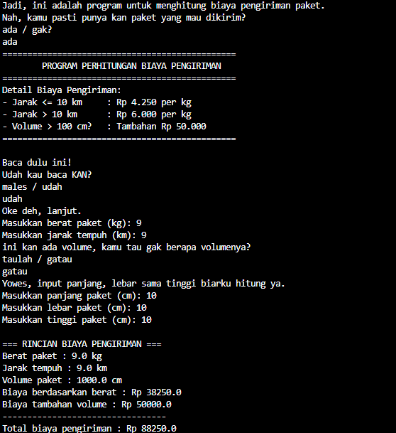

# Soal1MudahNo1
Sebelumnya, kita liat dulu deskripsi soalnya.

Sebuah perusahaan ekspedisi ternama mengirimkan paket-paket ke berbagai daerah.
Biaya pengiriman tergantung pada berat paket, jarak tempuh serta volume barang...
Berikut adalah detail biaya pengiriman per kilogram:
Jarak kurang dari atau sama dengan 10 km: Rp 4250 per kg
Jarak lebih dari 10 km: Rp 6000 per kg
Volume paket akan dikenakan biaya Rp 50.000,- ketika volume melebihi 100 cm^3.
Buatlah sebuah program dalam bahasa Java untuk menghitung biaya total pengiriman berdasarkan berat paket jarak tempuh serta volume barang yang diketahui dengan menginputkan panjang, lebar serta tinggi dari paket.

So, kesimpulanku si, ini nanti buat perhitungan biaya pengiriman. Dengan Kriteria:
1. Jarak kurang dari atau sama dengan 10 km: Rp 4250 per kg
2. Jarak lebih dari 10 km: Rp 6000 per kg
3. Volume paket akan dikenakan biaya Rp 50.000,- ketika volume melebihi 100 cm^3.

Jadi ya, simple banget. Nanti pakai if & else juga bisa. Yang bikin mengkhawatirkan yaitu, kami lupa tentang rumus voilume tabung. Sisanya mudah.

Oke, sekarang waktunya membahas codingan saya. Cara saya menjawab kriteria pertama adalah
1. Jarak kurang dari atau sama dengan 10 km: Rp 4250 per kg =
  if (jarak <= 10) {
  biayaPerKg = 4250;
2. Jarak lebih dari 10 km: Rp 6000 per kg
   } else {
   biayaPerKg = 6000;
   }
3. Volume paket akan dikenakan biaya Rp 50.000,- ketika volume melebihi 100 cm^3.
  if (volume > 100) {
   biayaVolume = 50000;
  }
Khusus Volume, saya bikin spesial dari pada kriteria yang lain. Karena volume ada 2 cara. Yaitu, input volumenya langsung / input panjang, lebar, dan tinggi.

Just like that, for the **MAIN** quest. And, because i want to make it funny, i add some joke. Just check it out.

Oh yes, i will give you the screenshot of the program.

